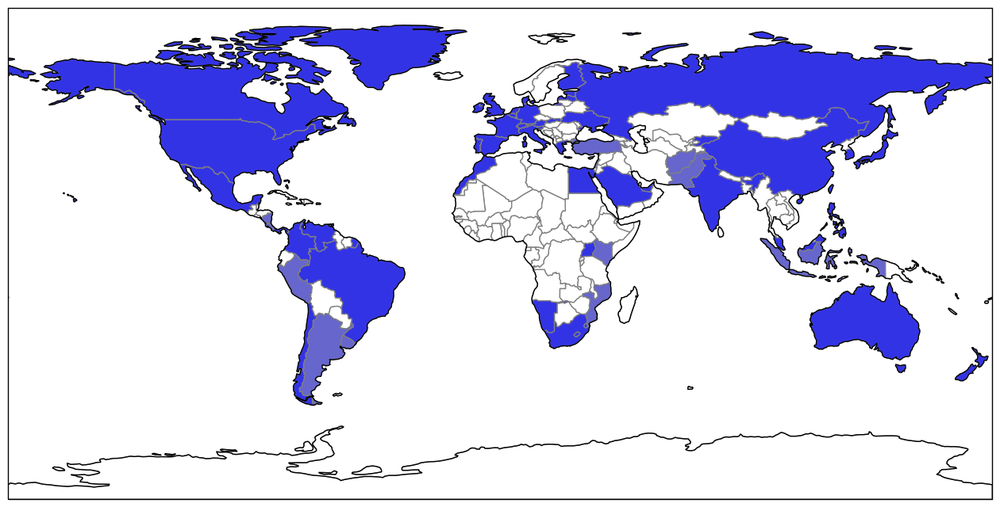

   Map of countries that I have currency for.
   Light blue indicates obsolete currency.

==================================
Joel's Foreign Currency Collection
==================================

A set of scripts for tracking my foreign currency collection.

Requirements
------------

Most of the scripts have no requirements other than Python, but generating the world map requires a bunch of libraries to be installed:

* Use ``sudo apt-get install python-tk``

.. I think I used to have cartopy or shapely or something compiling from source.
   An older version of this section said that these packages were required, but none of them seem to be required anymore:
   python-dev libproj-dev libgeos-dev libblas-dev gfortran libpng-dev libfreetype6-dev 

.. NOTE(jfriedly):  I grew up and started using a virtualenv for this:  ``workon foreign-currency``

* Use ``pip install Cython numpy scipy matplotlib enum34``

* Use ``pip install Cartopy``

TODO
----

* Add a git commit hook that generates the summary of all countries and inserts it into the README.

* Add a git commit hook to generate the map.

* Make sure that all the Eurozone countries have obsolete set to true on their most recent denomination.

* Store the data files with everything in some sorted order.  It'll make manual edits easier.

Notes by Country
----------------

Australia
'''''''''
The $5 bill that I have does not have a year printed on it.
I wrote it down as 1995 because that was the year that they started printing that series of note (and it is still in print).

Afghanistan
'''''''''''
In 2002, a new Afghani was issued following unrestricted printing under Taliban rule and the subsequent US invasion.
The new Afghanis have no subdivisions and replaced the old ones at two distinct rates (see below).
I don't know when mine was printed (I should make friends with someone who reads Farsi).

* Afghanis printed under President Burhanuddin Rabbani before the Taliban captured Kabul were valued at 1000:1

* Afghanis printed by the Northern Alliance (the government in exile during Taliban rule) were valued at 2000:1

Brazil
''''''
The 2 reais bill that I have does not have a year printed on it.
I wrote it down as 2000 because that was the first year that they printed 2 reais notes.

Britain
'''''''
See `UK`_.

CEMAC
'''''
The Communauté Économique et Monétaire de l'Afrique Centrale is a group of six countries administered by Coopération financière en Afrique (CFA).
The six countries are Cameroon, Central African Republic, Chad, Republic of the Congo, Equatorial Guinea and Gabon, but the Republic of Congo apparently *de facto* uses USD.
I went ahead and colored all of them as dark blue because I have both the official and unofficial currencies of Republic of the Congo.

Note that CFA also administers a separate group of 8 countries that form a western African monetary union, the Union Économique et Monétaire Ouest Africaine (UEMOA), and they also use a CFA franc.
Both are in fact called CFA francs and they trade at a 1:1 ratio, which leads to some confusion.
I've called the Central African CFA francs "CEMAC" francs, and if I get any of the West African CFA francs, I'll call them UEMOA francs.

Colombia
''''''''
Because of the current valuation of around 1900 Colombian pesos to 1 USD, the Colombian senate has debated redenomating the currency by introducing a new peso worth 1000 old pesos.
This hasn't happened yet, but my coins may soon be obsolete.
In 1984, production of all coins below 1 peso ended as a result of inflation.

Costa Rica
''''''''''
Coins of 1 colon and smaller are no longer found in circulation, and coins up to 20 colones are being withdrawn.
The Costa Rican colon has experienced a ton of inflation, but the government has decided to redenominate it yet.

China
'''''
I have one outdated bill, from the first series of the renminbi.
It's a 2 fen bill that I wrote down as 1955, although this date is approximate.
The second series was completely recalled in 2007.

I have some coins that are actually from the second series of the renminbi, but they're still legal tender.
These are the 2 and 5 fen coins.

I used to have one very old coin from the Qing Dynasty (Guangxu Emperor, 1875-1908).
It's the large brown coin with the square hole in the center.
This coin was minted between 1889 and 1908, and it probably had a denomination of the Qing yuan from 1889.
I've entered it with a date of 1889.
To find it on Google, search for "guang xu tong bao".
There were a number of denominations between this yuan and the modern renminbi, but I don't have any currency pieces from those, so I've ignored them.

*Update 2018-03-03:  I gave a bunch of coins to Lusann for Chinese New Year, including this one from the Qing Dynasty.*

East Africa Protectorate
''''''''''''''''''''''''
This country was created during British colonialism and no longer exists.
In 1920, it became the British colony of Kenya, and in 1963, it became the independent country of Kenya.
The coins apparently bore the name "East Africa" even after the region became the British colony of Kenya.
It occupied approximately the same area as modern-day Kenya.

I wasn't able to find actual information about the currency subdivisions of British Kenya, but modern Kenya uses a shilling that breaks down into 100 cents, so I'm reusing that.

Egypt
'''''
The years on the Egyptian coins that I have are a bit cryptic, but I apparently deciphered them at one point.
The gold-colored 1 milliemes coin that I have is from 1966, and the silver colored one is from 1972.

France
''''''
The 10 centime coin that I have has an unreadable date, but it was actually only minted between 1852 and 1857, so I entered it as 1855.
It's been obsolete since 1935.

The 2 franc coin that I have is actually from Vichy France.
This country existed only during the German occupation from 1940-1944 and was only sovereign in southern France.
Three days after the allied invasion of Normandy though, Germans spread into southern France, and while the continued to mint money, what remained of French autonomy on the continent essentially ended.

The banknotes that I have are all from the WWII period too.
The small 2 franc bill was actually a series printed by Americans and distributed immediately following the invasion of Normandy.
Charles De Gaulle, the leader of the Free French movement, objected though, calling it "counterfeit money", and the old franc fell back into circulation naturally.
The 5 and 10 franc bills that I have were replaced with coins in 1950 and became obsolete in 1960.
The same year, a "new" franc was introduced at a rate of 100 old francs to 1 new franc.
The 1 franc coin that I have is from this new series, which lasted until the Euro in 2002.

The denominations that I've encoded are:  post-1960 "new francs", pre-1960 "old francs", "vichy francs" (1940-1942), "us occupation francs" (1944), and "second french empire francs" (1852-1870).

Hong Kong
'''''''''
All coins with denominations less than 10 cents have been taken out of circulation, even though they were minted for circulation as late as 1979.

Indonesia
'''''''''
The 25 rupiah bill is officially obsolete, replaced by new rupiah in 1965.
The new rupiah is still valid, but it has suffered and denominations of less than 50 rupiah have been rendered obsolete by inflation.
Bank Indonesia has announced plans to redenominate at 1000:1, but they probably won't take effect until 2020.

Japan
'''''
While the sen was historically one hundredth of a yen, and the rin was one thousandth of a yen, they were both removed from circulation in 1953.
The 5 sen coin that I have was only minted in 1941-1942.

Kyrgyzstan
''''''''''
The 1 tyiyn note that I have is technically legal tender, but it's worth such a tiny fraction of a cent that it's hardly ever used.

Lebanon
'''''''
While the 1 piastre coin that I have is still technically legal tender, inflation has rendered it valueless, so I marked it as obsolete.

Macau
'''''
Macau is also spelled Macao, and since Natural Earth uses this name, I have its long name saved as "Macao".

Malaysia
''''''''
The 1 ringgit bill that I have doesn't have a date on it, but it was printed between 2000 and 2012, so I wrote it down as 2000.

Mexico
''''''
The giant 25 peso coin that I have from 1968 is actually 72% silver, containing 0.5208 troy ounces of silver (about $8 worth, right now).

Mozambique
''''''''''
The 500 escudo bill that I have bears the date "22 de Marco de 1967", but so does every 500 escudo bill that I could find online.
I entered it with a printing date of 1967, but it's probably inaccurate.

Nicaragua
'''''''''
The 1 centavo bill that I have doesn't have a date on it, but these bills were only printed between 1991 and 1994, so I put it in as 1991.
While it's technically still legal tender, it's worth less than a cent, so it's practically obsolete.

Pakistan
''''''''
The Pakistani rupee was originally subdivided into 16 annas, each of which was further subdivided into 4 pice, each of which was further subdivided into 3 pie.
In 1961 though, the currency was decimalised, with one rupee being subdivided into 100 pice.

Peru
''''
Peru has gone through three currencies in the last few decades, but unfortunately with naming collisions.
The nuevo sol is the "new" sol that is in circulation, but officially it's just called "sol".
Before the new sol was the inti (1985-1991), and before that was the "old" sol, which I have a few of.
Both the inti and the new sol were subdivided into 100 centimos, so I'm tracking subdivisions for the new sol and the old sol, but I've left the inti and its centimos out entirely.

Philippines
'''''''''''
From 1942-1945, Japan occupied the Philippines and distributed fiat banknotes.
I have some, but these were considered illegal tender immediately following WWII.

Republic of the Congo
'''''''''''''''''''''
See `CEMAC`_.

Russia
''''''
The 10-ruble note that I have is dated 1997, but it was actually release in 1998 after the redenomination.

Saudi Arabia
''''''''''''
The 1 riyal bill that I have doesn't bear a date in any language that I can read.
It was printed between 1984 and 2007, so I entered it as 1984.

Slovenia
''''''''
The 1 tolar bill that I have doesn't have a year on it, but it was first printed in 1991, so I entered it as being from 1991.

South Africa
''''''''''''
The South African rand is the currency of South Africa, and of the Common Monetary Area, a group of four countries similar to the Eurozone:  Namibia, Lesotho, and Eswatini.
Since the currency is in circulation in each of these countries, I've marked them all as dark blue on the map, but the currency "lives" under South Africa.

South Korea
'''''''''''
The bills that I have don't have years printed on them in any language I can understand, so I put them in as being from the first year that they were each printed, 1983 and 2006.

Taiwan
''''''
The New Taiwan Dollar is usually simply referred to as the yuan.
Because of this, I've set the denominations as yuan, jiao, and cents.

I could barely find dates anywhere for Taiwanese currency, but what I have has no dates on it.
I found a 100 yuan bill from 1972 that looks identical, so I counted mine as from 1972.
I did the same thing for a 1 yuan bill from 1961.
The 1 yuan coins are the large shiny ones, and I'm not sure where I got the dates from, but I think I must've actually deciphered the Chinese at some point.
The half yuan coins are the large brown ones, and the small shiny one is the jiao coin.

For future reference, and the page that had photos of old Taiwanese bills was here:  http://www.banknotes.com/tw.htm.
Also, search for "yuan", not "New Taiwan Dollar".

Unfortunately, the central bank began issuing new bills and coins in 2000, and they withdrew all of the old ones from circulation.
Since everything I have is older than that, it's all practically speaking obsolete.

Thailand
''''''''
The coin that I have doesn't have a year on it in a language that I can understand, so I put it in as being from the first year that it was minted, 1986.

UK
''
The pound sterling has a long history.
The pound used to be worth 240 pence, but since decimalisation in 1971, it's been worth 100 pence.
Unfortunately, I have some pence from both before and after 1971, so I have count them as different denominations.
The current one consists of "pounds", "pence", and the "halfpenny", while the obsolete one consists of the units that I've actually seen:  "pence", "shillings", and "pounds".

I also have a pound note from the British Armed Forces.
They issued their own banknotes for use on bases between 1946 and 1972.
This is a separate denomination, because these pounds were only usable on British military bases.

I also have a 5 pence coin from the Isle of Man, and so does Dan Faber.
The Isle of Man is an island between Britain and Ireland and is an official self-governing Crown dependency.
The government of the Isle of Man has established a de facto currency union with the UK, where the Manx government has decided to make UK currency legal tender on the island, but also issues its own independent currency.
While the currency units are the same, and I think the coins look similar enough to be spendable anywhere in the UK, I'm not counting them as the same denomination for consistency with Gibraltar (see below).

Dan also has 15 pounds of Gibraltar currency, which is another semi-autonomous island controller by the UK.
British currency is legal tender there, just as it is in the Isle of Man, and the Gibraltar is issued on par with the British pound against reserves of sterling.
Many Gibraltar shops also accept Euros, due to the tourist economy.
Dan only has bills, and the bills look nothing like their British counterparts, so I have a separate denomination for them.

Ukraine
'''''''
I have a 5 kopiyka coin from 1992 that is actually legal tender.
In 1996, the Ukrainian government redenominated the currency from karbovanets into hyrven', but they had actually begun printing and minting the new currency all the way back in 1992.

Venezuela
'''''''''
The 2 bolivares bill that I have says that it was printed in 2007, but I know that it was issued in 2008 *after* the redenomination.
The bills being printed before the redenomination all had face values in the thousands of bolivares.

Glossary
--------

* *denomination* - One value-distinct series of a country's currency.  Every coin or bill comes from exactly one *denomination*.  I use the word to differentiate between currencies that have been redenominated.  I do not use the word to refer to the face value of a coin or bill, nor do I use it to refer to different printing series of value-equivalent currency pieces.  Examples:

    * Argentina has redenominated it's currency four times since 1969, and these are the most recent four *denominations* of Argentine currency:  the peso ley, the peso argentino, the austral, and the peso convertible.  The peso ley was replaced at a ratio of 10000:1 by the peso argentino in 1983, the peso argentino was replaced at a ratio of 1000:1 by the austral in 1985, and the austral was replaced at a rate of 10000:1 by the peso convertible in 1992.  As a rule of thumb, I ignore denominations for which I have no currency pieces, but I've included the Argentinian ones as a codified example.

    * The UK split the pound sterling into 240 pence for many years, but then decimalized in 1971, making a pound worth 100 pence.  These two distinct values form the UK's most recent two *denominations*.

    * The US released a new series of colorful dollar bills starting in 2004, but these bills have equivalent value to the previous printing series, so they are not distinct *denominations*.

* *subunit* - A subdivision of a denomination's principal unit.  Examples:

    * The US dollar has the cent as a *subunit*, with one dollar composed of 100 cents.

    * Before 1971, the pound sterling had shillings and pence as *subunits*, with one pound composed of 20 shillings, which were each composed of 12 pence.  After 1971, the new denomination had new pence as a *subunit*, with one pound composed of 100 pence.

.. _`a known issue`: https://github.com/SciTools/cartopy/issues/682
