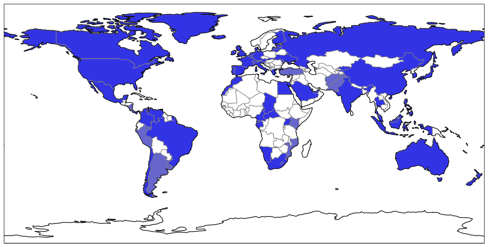

   Incomplete map of countries that I have currency for.
   Light blue indicates obsolete currency.

==================================
Joel's Foreign Currency Collection
==================================

A set of scripts for tracking my foreign currency collection.
Most of the countries that I have currency for are not yet tracked digitally with these scripts.

Requirements
------------

Most of the scripts have no requirements other than Python, but generating the world map requires a bunch of libraries to be installed:

* Use ``apt-get install libpng-dev libblas-dev liblapack-dev gfortran libproj-dev`` to get the Debian package dependencies.

* Use ``pip install Cython numpy shapely pyshp matplotlib scipy six`` to get the Python package dependencies.

* Then you can compile ``cartopy`` (>=0.11.2) from source, because the current version is outdated on PyPI.

TODO
----

* Replace the word "denomination" with "unit" throughout the code

* Replace the word "divisions" with "subdivision" throughout the code

* Use classes to represent countries and currency pieces

Notes by Country
----------------

Australia
'''''''''
The $5 bill that I have does not have a year printed on it.
I wrote it down as 1995 because that was the year that they started printing that series of note (and it is still in print).

Afghanistan
'''''''''''
In 2002, a new Afghani was issued following unrestricted printing under Taliban rule and the subsequent US invasion.
The new Afghanis have no subdivisions and replaced the old ones at two distinct rates (see below).
I don't know when mine was printed (I should make friends with someone who reads Farsi).

* Afghanis printed under President Burhanuddin Rabbani before the Taliban captured Kabul were valued at 1000:1

* Afghanis printed by the Northern Alliance (the government in exile during Taliban rule) were valued at 2000:1

Brazil
''''''
The 2 reais bill that I have does not have a year printed on it.
I wrote it down as 2000 because that was the first year that they printed 2 reais notes.

Britain
'''''''
See `UK`_

Colombia
''''''''
Because of the current valuation of around 1900 Colombian pesos to 1 USD, the Colombian senate has debated redenomating the currency by introducing a new peso worth 1000 old pesos.
This hasn't happened yet, but my coins may soon be obsolete.
In 1984, production of all coins below 1 peso ended as a result of inflation.

Costa Rica
''''''''''
I couldn't find it explicitly stated anywhere, but I'm pretty sure that the 50 centimos coin that I have is obsolete.

China
'''''
I have one outdated bill, from the first series of the renminbi.
It's a 2 fen bill that I wrote down as 1955, although this date is approximate.
The second series was completely recalled in 2007.

I have some coins that are actually from the second series of the renminbi, but they're still legal tender.
These are the 2 and 5 fen coins.

East Africa Protectorate
''''''''''''''''''''''''
This country was created during British colonialism and no longer exists.
In 1920, it became the British colony of Kenya, and in 1963, it became the independent country of Kenya.
The coins apparently bore the name "East Africa" even after the region became the British colony of Kenya.
It occupied approximately the same area as modern-day Kenya.

I wasn't able to find actual information about the currency subdivisions of British Kenya, but modern Kenya uses a shilling that breaks down into 100 cents, so I'm reusing that.

France
''''''
The 10 centime coin that I have has an unreadable date, but it was actually only minted between 1852 and 1857, so I entered it as 1855.
It's been obsolete since 1935.

The 2 franc coin that I have is actually from Vichy France.
This country existed only during the German occupation from 1940-1944 and was only sovereign in southern France.
Three days after the allied invasion of Normandy though, Germans spread into southern France, and while the continued to mint money, what remained of French autonomy on the continent essentially ended.

The banknotes that I have are all from the WWII period too.
The small 2 franc bill was actually a series printed by Americans and distributed immediately following the invasion of Normandy.
Charles De Gaulle, the leader of the Free French movement, objected though, calling it "counterfeit money", and the old franc fell back into circulation naturally.
The 5 and 10 franc bills that I have were replaced with coins in 1950 and became obsolete in 1960.
The same year, a "new" franc was introduced at a rate of 100 old francs to 1 new franc.
The 1 franc coin that I have is from this new series, which lasted until the Euro in 2002.

With so many different franc currencies made obsolete at different times, I've decided to not even attempt to differentiate between the them.
Everything in my collection for France is either francs or centimes, and they're all obsolete with the Euro.

Hong Kong
'''''''''
All coins with denominations less than 10 cents have been taken out of circulation, even though they were minted for circulation as late as 1979.

Indonesia
'''''''''
All denominations of less than 50 rupiah have been rendered obsolete by inflation.

Japan
'''''
While the sen was historically one hundredth of a yen, and the rin was one thousandth of a yen, they were both removed from circulation in 1953.
The 5 sen coin that I have was only minted in 1941-1942.

Kyrgyzstan
''''''''''
The 1 tyiyn note that I have is technically legal tender, but it's worth such a tiny fraction of a cent that I'm counting it as obsolete.

Macau
'''''
Macau is also spelled Macao, and since Natural Earth uses this name, I have its long name saved as "Macao".

Malaysia
''''''''
The 1 ringgit bill that I have doesn't have a date on it, but it was printed between 2000 and 2012, so I wrote it down as 2000.

Nicaragua
'''''''''
The 1 centavo bill that I have doesn't have a date on it, but these bills were only printed between 1991 and 1994, so I put it in as 1991.
While it's technically still legal tender, it's worth less than a cent, so it's practically obsolete.

Pakistan
''''''''
The Pakistani rupee was originally subidivded into 16 annas, each of which was further subidivided into 4 pice, each of which was further subdivided into 3 pie.
In 1961 though, the currency was decimalised, with one rupee being subdivided into 100 pice.
Since all of my coins are older than 1961, I have the pre-decimalization subdivision scheme encoded, but I'll need to fix that up if I ever get any new coins.

Peru
''''
Peru has gone through three currencies in the last few decades, but unfortunately with naming collisions.
The nuevo sol is the "new" sol that is in circulation, but officially it's just called "sol".
Before the new sol was the inti (1985-1991), and before that was the "old" sol, which I have a few of.
Both the inti and the new sol were subdivided into 100 centimos, so I'm tracking subdivisions for the new sol and the old sol, but I've left the inti and its centimos out entirely.

Philippines
'''''''''''
From 1942-1945, Japan occupied the Philippines and distributed fiat banknotes.
I have some, but these were considered illegal tender immediately following WWII.

Slovenia
''''''''
The 1 tolar bill that I have doesn't have a year on it, but it was first printed in 1991, so I entered it as being from 1991.

UK
''
The pound sterling has a long history.
The pound used to be worth 240 pence, but since decimalisation in 1971, it's been worth 100 pence.
Unfortunately, I have some pence from both before and after 1971, so I have to count them as different units.
There's also been a dozen other obsolete units between a pound and a farthing, and I have some of those too.
In an effort to avoid confusion, I've implemented two different subdivision sets, a current one and an obsolete one.
The current one consists of "pounds", "pence", and the "halfpenny", while the obsolete one consists of only the units that I've actually heard of:  "farthings", "old pence", "shillings", "crowns", and "sovereigns" (a.k.a. pounds).

I also have a pound note from the British Armed Forces.
They issued their own banknotes for use on bases between 1946 and 1972.

I also have a 5 pence coin from the Isle of Man.
The Isle of Man is an island between Britain and Ireland and is an official self-governing Crown dependency.
The government of the Isle of Man has established a de facto currency union with the UK, where the Manx government has decided to make UK currency legal tender on the island, but also issues its own independent currency.
The currency units are the same, and I think the coins look similar enough to be spendable anywhere in the UK.
